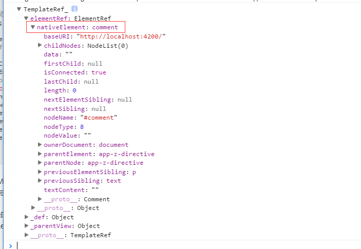
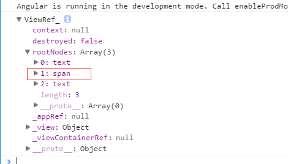
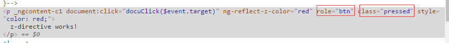

# angular4  Directive

## angular指令分为三种
<ol>
  <li>组件(Component):构建UI组件，继承Directive类</li>
  <li>属性指令(Attribute):用于改变组件的外观或行为</li>
  <li>结构指令：用于动态添加或删除DOM元素来改变DOM布局</li>
</ol>

### 组件
一个项目的组成都是通过组件构建而成的
```javascript
import { Component } from '@angular/core';
@Component({
  selector: 'my-app', 
  template: `<h1>Hello {{name}}</h1>`, 
})
export class AppComponent  {
  name = 'zZ'; 
}
```

### 属性指令

#### 内置的属性指令 
1.`ngStyle`指令
```javascript
<div [ngStyle]="{'background-color': 'green'}"></div>
<div [ngStyle]="{'background-color': person.country === 'UK' ? 'green' : 'red'}">

<div [ngStyle]="{'color': getColor(person.country)}"></div>

getColor(country){……}

```

2.`ngClass`指令
```javascript
<div [ngClass]="{'text-success': true }"></div>
<div [ngClass]="{'text-success': person.country === 'CN'}"></div>
```

#### 自定义属性指令
鼠标移入添加style移出清除style

<b>通过`ElementRef`来操作`DOM`：在应用层直接操作DOM，会造成应用层与渲染之间强耦合，导致应用无法在不同环境下运行。(浏览器中native通常指DOM)`elementRef.nativeElement`</b>

```html
<p [zBtn]="'red'"> 鼠标移入移出改变样式 </p>
```
```javascript
import { Directive, Input, ElementRef, Renderer2, HostListener } from '@angular/core';

@Directive({
  selector: '[zBtn]'
})
export class ZBtnDirective {
  private defaultColor = 'yellow';
  @Input('zBtn') zColor: string;
  constructor(private elementRef: ElementRef, private renderer: Renderer2) { }

  @HostListener('mouseover')
  mouseoverBtn() {  // 监听鼠标移入事件
    this.setStyle(this.zColor || this.defaultColor);
  }

  @HostListener('mouseout')
  mouseoutBtn() {  // 监听鼠标移出事件
    this.removeStyle(this.zColor || this.defaultColor);
  }

  private setStyle(color: string) {
    this.renderer.setStyle(this.elementRef.nativeElement, 'color', color);
  }

  private removeStyle(color: string) {
    this.renderer.removeStyle(this.elementRef.nativeElement, 'color');
  }
}
```


## 结构属性

### 内置结构属性
1.`ngIf`指令

`<div *ngIf="person === 'CN'">{{name}}</div>`

2.`ngFor`指令
`<div *ngFor="let item of list">{{item}}</div>`

3.`ngSwitch`指令
```javascript
<ul [ngSwitch]='person.country'>
  <li *ngSwitchCase="'UK'">
      {{ person.name }} 
  </li>
   <li *ngSwitchCase="'USA'" >
      {{ person.name }}
  </li>
  <li *ngSwitchDefault>
    {{ person.name }}
  </li>
</ul>
```

### 自定义结构指令

1.`ViewContainerRef`主要用来创建和管理内嵌视图或组件视图的。

2.`TemplateRef` 通过TemplateRef实例方面创建内嵌视图,能轻松的访问通过ELenentRef封装后的nativeElement。组件视图中的templatem模板元素,经过渲染后会替换成comment元素
<br>

```javascript
import { Component, OnInit, TemplateRef, AfterViewInit, ViewChild, ViewContainerRef } from '@angular/core';
@Component({
  selector: 'app-z-directive',
  // templateUrl: './z-directive.component.html',
  template: `
    <h1>Welcome to Angular World</h1>
    <template #tpl>
      <span>I am span in template</span>
    </template>
  `,
  styleUrls: ['./z-directive.component.scss']
})
export class ZDirectiveComponent implements OnInit, AfterViewInit {
  @ViewChild('tpl')
  tpl: TemplateRef<any>;

  @ViewChild('tpl', { read: ViewContainerRef })
  tplVcRef: ViewContainerRef;

  constructor() { }
  ngOnInit() {
  }
  ngAfterViewInit() {
    // this.tpl.createEmbeddedView(null) //创建后在rootNodes中也能看到span元素
    // console.dir(this.tpl);
    // 基于TemplateRef创建内嵌视图，并添加到视图容器中
    this.tplVcRef.createEmbeddedView(this.tpl);
  }

}
```
<br>


<b>列子：通过值让dom显示影藏</b><br>
html：
```html
<p [zBtn]="'red'" *zRomoveEle='isshow'>
  z-directive works!
</p>
```
typescript：
```typescript
import { Directive, Input, ViewContainerRef, TemplateRef } from '@angular/core';
@Directive({
  selector: '[zRomoveEle]'
})
export class ZRomoveEleDirective {
  @Input('zRomoveEle')
  set condition(newCondition: boolean) {
    if (!newCondition) { // 创建模板对应的内嵌视图
      this.viewContainer.createEmbeddedView(this.templateRef);
    } else {
      this.viewContainer.clear();
    }
  }
  constructor(private viewContainer: ViewContainerRef, private templateRef: TemplateRef<any>) {
  }
}
```


### 指令中 getter & setter方法
>通过setrer和getter来约束属性的设置和获取，通过这个方式我们在类中的私有属性进行了封装，能避免外接的操作来影响该私有属性。在setter可以封装一些业务逻辑
```html
<p>值：{{count}}</p>
<button (click)="add()">++</button>
<button (click)="del()">--</button>
```
```javascript
import { Component, Input } from '@angular/core';
export class ZDirectiveComponent {
  _count = 0;
  @Input()
  set count(num: number){
    console.log(num);
    if (num > 10) { num = 10; };
    this._count = num;
  }
  get count(): number{
    return this._count;
  }
  add() {
    this.count++;
  }
  del() {
    this.count--;
  }
}

```


## 直接使用DOM API获取页面元素
> 不推荐使用 ElementRef.nativeElement.querySelector()
```javascript
 @Component({
  selector: 'my-comp',
  template: `
    <input type="text" />
    <div> Some other content </div>
  `
})
export class MyComp {
  constructor(el: ElementRef) {
    el.nativeElement.querySelector('input').focus();
  }
}
```
>推荐使用@ViewChild
```javascript
@Component({
  selector: 'my-comp',
  template: `
    <input #myInput type="text" />
    <div> Some other content </div>
  `
})
export class MyComp implements AfterViewInit {
  @ViewChild('myInput') input: ElementRef;

  constructor(private renderer: Renderer) {}

  ngAfterViewInit() {
    this.renderer.invokeElementMethod(
        this.input.nativeElement, 'focus');
    }
}
```

@ViewChild() 属性装饰器，还支持设置返回对象的类型，具体使用方式如下：

```javascript
@ViewChild('myInput') myInput1: ElementRef;
@ViewChild('myInput', {read: ViewContainerRef}) myInput2: ViewContainerRef;
//若未设置 read 属性，则默认返回的是 ElementRef 对象实例。
```


# angular4  viewChild & ViewChildren
> ViewChild 装饰器用于获取模板视图中的元素，它支持 Type 类型或 string 类型的选择器，同时支持设置 read 查询条件，以获取不同类型的实例。而 ViewChildren 装饰器是用来从模板视图中获取匹配的多个元素，返回的结果是一个 QueryList 集合。

## viewChild
>ViewChild 是属性装饰器，用来从模板视图中获取匹配的元素。视图查询在 ngAfterViewInit 钩子函数调用前完成，因此在 ngAfterViewInit 钩子函数中，才能正确获取查询的元素。

:原因在appComponentc创建实例后才会自动调取原型上createInternal的方法，才开始创建组件中元素，所以在构造函数中是获取不到viewchild查询视图元素的

<b>通过模板变量名来获取元素</b>
```html
 <p #Pview>hello</p>
```
```typescript
import { Component, OnInit, ViewChild, AfterViewInit,ElementRef } from '@angular/core';
@Component({
  selector: 'view-Child',
  templateUrl: './viewChild.component.html',
  styleUrls: ['./viewChild.component.css']
})
export class ViewChildComponent implements AfterViewInit {
  @ViewChild('Pview')
  viewP: ElementRef;
  ngAfterViewInit() {
    console.log(this.viewP);
  }
}
```

<b>使用类型查询</b>
```html
<div>
  viewChild works!
  <app-z-directive></app-z-directive>
</div>
```
```typescript
import { ZDirectiveComponent } from './../z-directive/z-directive.component';
import { Component, OnInit, ViewChild, AfterViewInit, ViewChildren, ElementRef } from '@angular/core';
@Component({
  selector: 'view-Child',
  templateUrl: './viewChild.component.html',
  styleUrls: ['./viewChild.component.css']
})
export class ViewChildComponent implements AfterViewInit {
  @ViewChild(ZDirectiveComponent)
  childCmp: ZDirectiveComponent;
  ngAfterViewInit() {
    console.log(this.childCmp);
  }

}
```

### ViewChildren
>ViewChildren 用来从模板视图中获取匹配的多个元素，返回的结果是一个 QueryList 集合。
```html
```

```typescript
import { ZDirectiveComponent } from './../z-directive/z-directive.component';
import { Component, OnInit, ViewChild, AfterViewInit, ViewChildren, ElementRef } from '@angular/core';

@Component({
  selector: 'view-Child',
  templateUrl: './viewChild.component.html',
  styleUrls: ['./viewChild.component.css']
})
export class ViewChildComponent implements OnInit, AfterViewInit {

  @ViewChildren(ZDirectiveComponent)
  childsCmp: ZDirectiveComponent

  ngAfterViewInit() {
    console.log(this.childsCmp);
  }
}
```


##  ContentChild & ContentChildren


## HostListener @ HostBinding
>HostBinding 为宿主元素添加监听事件 （应用指令的元素就是宿主元素）

>HostBinding 动态的设置宿主元素的属性值。（添加attr、class）


通过`HostListener`添加事件并监听;鼠标移入通过`HostBinding`动态的给宿主添加class和attr

```typescript
import { Directive, Input, ElementRef, Renderer2, HostListener, HostBinding } from '@angular/core';

@Directive({
  selector: '[zBtn]',
})
export class ZBtnDirective {
  private defaultColor = 'yellow';
  @Input('zBtn') zColor: string;
  constructor(private elementRef: ElementRef, private renderer: Renderer2) { }

  @HostBinding('attr.role') role = 'btn';
  @HostBinding('class.pressed') isPressed: boolean;

  @HostListener('mouseover')
  mouseoverBtn() {  // 监听鼠标移入事件
    this.isPressed = true;
  }

  @HostListener('mouseout')
  mouseoutBtn() {  // 监听鼠标移出事件
    this.isPressed = false;
  }
}
```
```class
.pressed {
    color: #fff;
}
```
```html
<p zBtn>
  z-directive works!
</p>
```
<b>通过`hostBinding`动态的添加了`class`和`attr`</b>
<br>


## 组件之间通讯方式

### 输入属性（父 => 子）
<b>通过`[count]`初始化count</b>
```typescript
//子
@Component({
    selector: 'exe-counter',
    template: `
      <p>当前值: {{ count }}</p>
      <button (click)="add()"> + </button>
    `
})
export class CounterComponent {
    @Input() count: number = 0;
    add() {
        this.count++;
    }
}
//父
@Component({
  selector: 'exe-app',
  template: `
   <exe-counter [count]="initialCount"></exe-counter>
  `
})
export class AppComponent {
  initialCount: number = 5;
}
```


###　输出属性（子　＝＞　父）
<b>通过`EventEmitter`的`emit`向父传递数据</b>
```typescript
子：
import { Component, Input, Output, EventEmitter } from '@angular/core';

@Component({
    selector: 'exe-counter',
    template: `
      <p>当前值: {{ count }}</p>
      <button (click)="increment()"> + </button>
    `
})
export class CounterComponent {
    @Input() count: number = 0;
    @Output() change: EventEmitter<number> = new EventEmitter<number>();
    increment() {
        this.count++;
        this.change.emit(this.count);
    }
}

父：
@Component({
  selector: 'exe-app',
  template: `
   <p>{{changeMsg}}</p> 
   <exe-counter [count]="initialCount" 
    (change)="countChange($event)"></exe-counter>
  `
})
export class AppComponent {
  initialCount: number = 5;
  changeMsg: string;
  countChange(event: number) {
    this.changeMsg = `子组件change事件已触发，当前值是: ${event}`;
  }
}
```

### 模板变量
