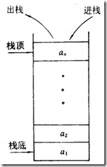
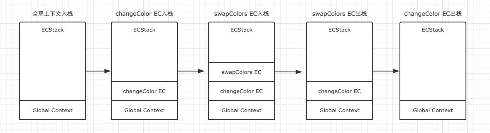
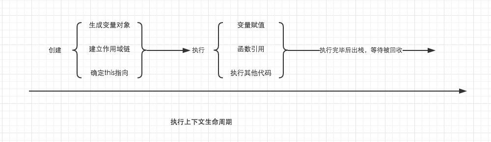
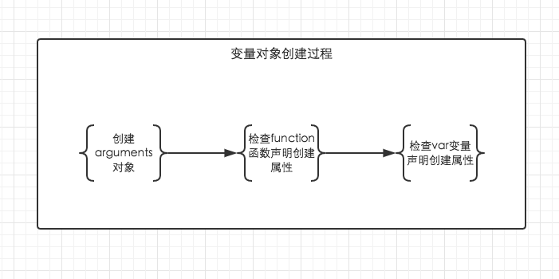

# JavaScript

## 栈 （栈内存）
 `栈-stack：为自动分配的内存空间，它由系统自动释放`<br>
<br>
 栈是一种特殊的线性表，限定删除和插入数据元素只能7在一端进行。<br>
 如球盒一样,第一个放入的球在栈底,最后一个球放入的在栈顶,如需拿到第一个放入的求,只能从栈顶一个一个拿出到达栈底。<br>
 栈空间：<b>先进后出、后进先出——Last in Fist out (LIFO)线性表</b>
 
 
## 堆 
 `堆-heap：则是动态分配的内存，大小不定也不会自动释放.`<br>
 如书架，需要取书时，只需知道书的名字就可以直接拿到，无需像球盒一样从最顶部拿出取到需要的球,如json中取数据只要知道`键 key`就可以拿到，顺序并不影响我们，只关心书名。
 

## 浅拷贝
>在定义一个数组或对象时，变量存放的<b>只是放在堆内存数据的一个地址(指针)</b><br>
当拷贝,操作引用类型时,这时候传递只是地址，子对象访问属性时，会根据地址回到父对象指向的堆内存中，父子对象发送了关联,父子指向的同一内存空间.如需让父子不存在关联可通过基础类型来进行赋值。
```javascript
var a = {
    key1:"11111"
}
function Copy(p) {
    var c = {};
    for (var i in p) { 
        c[i] = p[i];
    }
    return c;
}
a.key2 = ['aa','bb'];
var b = Copy(a);
b.key3 = '33333';
alert(b.key1);     //1111111
alert(b.key3);    //33333
alert(a.key3);    //undefined
```

## 深拷贝
>在浅拷贝中如果`b.key2.push('zz')`后a、b的key2值还是产生关联。<br>
解决key2中关联可用递归来解决这个问题
```
console.log(b.key2) //[aa,bb,zz]
console.log(a.key2) //[aa,bb,zz]
```
```javascript
function Copy(p, c) {
var c = c || {};
    for (var i in p) {
        if (typeof p[i] === 'object') {
            c[i] = (p[i].constructor === Array) ? [] : {};
            Copy(p[i], c[i]);
        } else {
            c[i] = p[i];
        }
    }
    return c;
}    
a.key2 = ['aa','bb'];
var b={};
b = Copy(a,b);	   
b.key2.push("cc");
alert(b.key2);    //aa bb cc
alert(a.key2);    //aa bb

```


## 执行上下文(call stack)

>执行代码时都进入执行上下文,他会形成一个作用域。会以堆栈的方式处理它们。栈底永远都是全局上下文，栈顶就是当前正在执行的上下文

```javascript
var name = 'zChange';
function changeName(){
    var oldname = "zz";

    function helloword(){
        var newname = oldname;
        oldname = name;
        name = oldname;
    }
    helloword();
}
changeName();
```
>函数中，遇到return能直接终止可执行代码的执行，因此会直接将当前上下文弹出栈。

```
1.全局上下文入栈 
2.changename入栈 遇到changename() 激活changename 创建他自己的上下文.
3.helloword入栈 遇到helloword() 激活helloword 创建他自己的上下文.

4.helloword出栈 在helloword没有遇到其他能生成上下文的情况，因此这段代码执行完毕，helloword弹出
5.changename出栈 继续执行changename中可执行的代码，也没遇到能生成上下文的情况，这段代码执行完毕，changename弹出
6.就只剩下全局全局上下文了，全局上下文在浏览器窗口关闭后出栈。
```
<b>每次某个函数被调用，就会有新的执行上下文创建，即使是调用自身函数</b>
<b>

## 执行上下文生命周期
>创建阶段：创建变量对象、建立作用域、this的指向z

>代码执行阶段：变量赋值、函数引用、执行其他代码

<b>知识点：1.变量对象 2.作用域链 3.this</b>

<br>

### 变量对象
创建变量对象=><br>
1.建立argument对象<br>

2.检查上下文的函数声明,function关键字，在变量中以函数名建立个属性，属性值指向该函数所在的内存空间,如果函数属性已经存在，那么这个函数会被新的覆盖<br>

3.检查上下文中的变量声明，找到一个,就在变量对象中建立个属性，值未undefined,如果属性已经存在,为了防止同名函数被修改成undefined,则会跳过。原属性不会覆盖。<br>
<br>

```javascript
function test() {
    console.log(foo);
    console.log(bar);

    var foo = 'Hello';
    console.log(foo);
    var bar = function () {
        return 'world';
    }

    function foo() {
        return 'hello';
    }
}

test();
//funtion (){return 'hello'}
//undefined
//Hello
```
> 可理解为
```javascript
function test() {
    function foo() {
        return 'hello';
    }
    console.log(foo);
    var bar;
    console.log(bar);
    var foo = 'Hello';
    console.log(foo);

    var bar = function () {
        return 'world';
    }
}
```
```javascript
// 创建阶段
// VO 为 Variable Object的缩写，即变量对象
VO = {
    arguments: {...},
    foo: <foo reference>,
    bar: undefined
}
// 这里有一个需要注意的地方，因为var声明的变量当遇到同名的属性时，会跳过而不会覆盖

// 执行阶段
// AO 为 Active Object 活动对象
VO -> AO  //变量对象转向活动对象
VO = {
    arguments: {...},
    foo: 'Hello',
    bar: <bar reference>
}
```


