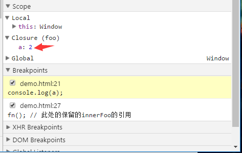
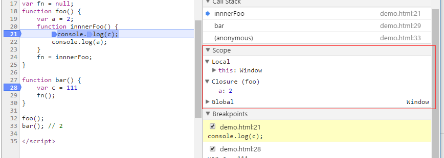

# JavaScript

## 栈 （栈内存）
> `栈-stack：为自动分配的内存空间，它由系统自动释放`<br>

<br>
 栈是一种特殊的线性表，限定删除和插入数据元素只能7在一端进行。<br>
 如球盒一样,第一个放入的球在栈底,最后一个球放入的在栈顶,如需拿到第一个放入的求,只能从栈顶一个一个拿出到达栈底。<br>
 栈空间：<b>先进后出、后进先出——Last in Fist out (LIFO)线性表</b>
 
 
## 堆 
> `堆-heap：则是动态分配的内存，大小不定也不会自动释放.`<br>

 如书架，需要取书时，只需知道书的名字就可以直接拿到，无需像球盒一样从最顶部拿出取到需要的球,如json中取数据只要知道`键 key`就可以拿到，顺序并不影响我们，只关心书名。
 

## 浅拷贝
>在定义一个数组或对象时，变量存放的<b>只是放在堆内存数据的一个地址(指针)</b><br>
当拷贝,操作引用类型时,这时候传递只是地址，子对象访问属性时，会根据地址回到父对象指向的堆内存中，父子对象发送了关联,父子指向的同一内存空间.如需让父子不存在关联可通过基础类型来进行赋值。
```javascript
var a = {
    key1:"11111"
}
function Copy(p) {
    var c = {};
    for (var i in p) { 
        c[i] = p[i];
    }
    return c;
}
a.key2 = ['aa','bb'];
var b = Copy(a);
b.key3 = '33333';
alert(b.key1);     //1111111
alert(b.key3);    //33333
alert(a.key3);    //undefined
```

## 深拷贝
>在浅拷贝中如果`b.key2.push('zz')`后a、b的key2值还是产生关联。<br>
解决key2中关联可用递归来解决这个问题
```
console.log(b.key2) //[aa,bb,zz]
console.log(a.key2) //[aa,bb,zz]
```
```javascript
function Copy(p, c) {
var c = c || {};
    for (var i in p) {
        if (typeof p[i] === 'object') {
            c[i] = (p[i].constructor === Array) ? [] : {};
            Copy(p[i], c[i]);
        } else {
            c[i] = p[i];
        }
    }
    return c;
}    
a.key2 = ['aa','bb'];
var b={};
b = Copy(a,b);	   
b.key2.push("cc");
alert(b.key2);    //aa bb cc
alert(a.key2);    //aa bb

```


## 执行上下文(call stack)

>执行代码时都进入执行上下文,他会形成一个作用域。会以堆栈的方式处理它们。栈底永远都是全局上下文，栈顶就是当前正在执行的上下文

```javascript
var name = 'zChange';
function changeName(){
    var oldname = "zz";

    function helloword(){
        var newname = oldname;
        oldname = name;
        name = oldname;
    }
    helloword();
}
changeName();
```
>函数中，遇到return能直接终止可执行代码的执行，因此会直接将当前上下文弹出栈。

```
1.全局上下文入栈 
2.changename入栈 遇到changename() 激活changename 创建他自己的上下文.
3.helloword入栈 遇到helloword() 激活helloword 创建他自己的上下文.

4.helloword出栈 在helloword没有遇到其他能生成上下文的情况，因此这段代码执行完毕，helloword弹出
5.changename出栈 继续执行changename中可执行的代码，也没遇到能生成上下文的情况，这段代码执行完毕，changename弹出
6.就只剩下全局全局上下文了，全局上下文在浏览器窗口关闭后出栈。
```
<b>每次某个函数被调用，就会有新的执行上下文创建，即使是调用自身函数</b>
<b>

## 执行上下文生命周期
>创建阶段：创建变量对象、建立作用域、this的指向z

>代码执行阶段：变量赋值、函数引用、执行其他代码

<b>知识点：1.变量对象 2.作用域链 3.this</b>

<br>

### 变量对象
创建变量对象=><br>
1.建立argument对象<br>

2.检查上下文的函数声明,function关键字，在变量中以函数名建立个属性，属性值指向该函数所在的内存空间,如果函数属性已经存在，那么这个函数会被新的覆盖<br>

3.检查上下文中的变量声明，找到一个,就在变量对象中建立个属性，值未undefined,如果属性已经存在,为了防止同名函数被修改成undefined,则会跳过。原属性不会覆盖。<br>
<br>

```javascript
function test() {
    console.log(foo);
    console.log(bar);

    var foo = 'Hello';
    console.log(foo);
    var bar = function () {
        return 'world';
    }

    function foo() {
        return 'hello';
    }
}

test();
//funtion (){return 'hello'}
//undefined
//Hello
```
> 可理解为
```javascript
function test() {
    function foo() {
        return 'hello';
    }
    console.log(foo);
    var bar;
    console.log(bar);
    var foo = 'Hello';
    console.log(foo);

    var bar = function () {
        return 'world';
    }
}
```
```javascript
// 创建阶段
// VO 为 Variable Object的缩写，即变量对象
VO = {
    arguments: {...},
    foo: <foo reference>,
    bar: undefined
}
// 这里有一个需要注意的地方，因为var声明的变量当遇到同名的属性时，会跳过而不会覆盖

// 执行阶段
// AO 为 Active Object 活动对象
VO -> AO  //变量对象转向活动对象
VO = {
    arguments: {...},
    foo: 'Hello',
    bar: <bar reference>
}
```


### 作用域or作用域链
> 作用域：作用域就是变量与函数可访问的范围，即作用域控制着变量与函数的可见性和生命周期。
或者可说为是一套规则，这规则用来管理引擎如何在当前作用域以及嵌套子作用域中根据标识符名称进行变量查找。

<b>作用域是在编译阶段确定规则的</b>
作用域可分为`全局作用域`和`局部作用域` 

> 作用域链：在执行上下文创建时，会创建变量对象的的一个作用域链（scope chain）。作用域链的用途，是保证对执行环境有权访问的所有变量和函数的有序访问。作用域链的前端，始终都是当前执行的代码所在环境的变量对象。如果这个环境是一个函数，则将其活动对象作为变量对象。

>需要注意的是作用域链是不会被复制的。每次函数调用只会往作用域链下面新增一个作用域对象。所以，如果在函数调用的过程当中对作用域链中的任何一个作用域对象的变量进行修改的话，那么同时作用域链中也拥有该作用域对象的函数对象也是能够访问到这个变化后的变量的。

<b>作用域链是在执行上下文创建阶段生成的</b>

```javascript
var a = 20;
function test() {
    var b = a + 10;
    function innerTest() {
        var c = 10;
        return b + c;
    }
    return innerTest();
}
test();

//innerTestEC 执行上下文
innerTestEC = {
    VO: {...},  // 变量对象
    scopeChain: [VO(innerTest), VO(test), VO(global)], // 作用域链
    this: {}
}

```
<br>
>例子中，全局、函数test、函数innerTest的执行上下文先后被创建

## 垃圾回收
>垃圾回收机制：函数的执行上下文,在执行完毕后，生命周期结束，该函数执行的上下文就会失去引用，其占用的内存空间也会被垃圾回收器释放，也就是说当一个值，在内存中失去引用，垃圾回收器将其回收释放

## 闭包
>闭包：有权访问另一个函数作用域中的变量的函数。


<b>闭包的存在就会阻止垃圾回收</b>
```javascript
var fn = null;
function foo() {
    var a = 2;
    function innnerFoo() { 
        console.log(a);
    }
    fn = innnerFoo; // 将 innnerFoo的引用，赋值给全局变量中的fn
}

function bar() {
    fn(); // 此处的保留的innerFoo的引用
}

foo();
bar();

innnerFoo = {
    VO: {...},  // 变量对象
    scopeChain: [VO(innnerFoo), VO(foo), VO(global)], // 作用域链
    this: {}
}

// 通过fn=innnerFoo 将innnerFoo的作用域链保存到全局变量fn中。
// 所以在后面bar()时，fn照样能访问foo中的局部变量a
```
<br>
<b>所以通过闭包,我们可以在其他执行上下文中，访问到函数内部变量</b>就是在bar执行上下文中能访问到foo的a变量.

>虽然闭包被保存到全局变量中，但是作用域链并不会发生改变,在闭包中能访问到的变量,仍然还是作用域链上能查到的变量

```javascript
var fn = null;
function foo() {
    var a = 2;
    function innnerFoo() { 
        console.log(c);//这里会报错。
        console.log(a);
    }
    fn = innnerFoo; 
}
function bar() {
    var c = 123;
    fn();
    //此时innnerFoo的作用域链是没有发生变化的。所以访问不到c变量;
}
foo();
bar();
```
<br>

<b>闭包例子：</b>
```javascript
function f1(){
　　　　var n=999;
　　　　nAdd=function(){n+=1}
　　　　function f2(){
            console.log(n);
　　　　}
　　　　return f2;
　　}
var result1=f1();//返回f2定义的函数对象
var result2=f1();//返回f2定义的函数对象,nAdd函数表达式重新赋值
console.log(result1===result2);　　//false
result1(); //999
result2();//999
nAdd();//999+1
result1();//999
result2();//1000
```

<ol>
<li>var result1=f1()：f1函数返回了f2函数 
把返回的f2函数赋值给result全局变量，（f2的作用域链保存到result全局变量中）</li>
<li>var result2=f1()：同上</li>
<li>result1===result2 false  这里创建的result1和result2是两个不同的作用域对象，尽管看上去是一样 所以是false</li>
<li>调用result1()，这就形成闭包：有权访问另外一个函数作用域中的变量
因为在f2中的作用域引用了f1中的n这个局部变量，当f1执行完毕后，垃圾回收机制发现n变量还在被result中引用所以垃圾回收机制不会把n回收释放。
以至于n一直保存在result作用域链中。result的作用域链正常能访问f1中的局部变量n，形成闭包。</li>
<li>result2()同上 </li>
<li>nAdd() nAdd没有写var所以nAdd是全局变量，在调用nAdd()和result()是一样的都会形成闭包，匿名函数function(){n+=1}的作用域链中有n这个局部变量，所以当nAdd=funtion(){n+=1}时，这个匿名函数的作用域链保存到了全局变量nAdd形成闭包，调用nAdd()作用域链中找到f1局部变量n=999，n+1=1000。</li>

<li>result1() 999 这里依旧是999 因为，在 result1=f1()和result2=f1()，因为nAdd是全局变量，匿名函数最后引用的是result2中的n，result2=f1()的时候，nAdd的作用域链的n被result2的n重新赋值了。result1中的n并没有被nAdd所影响</li>
<li>result2() 1000  nAdd的作用域链的n被result2的n重新赋值了，所以result2的n+1了，输出1000</li>
</ol>
